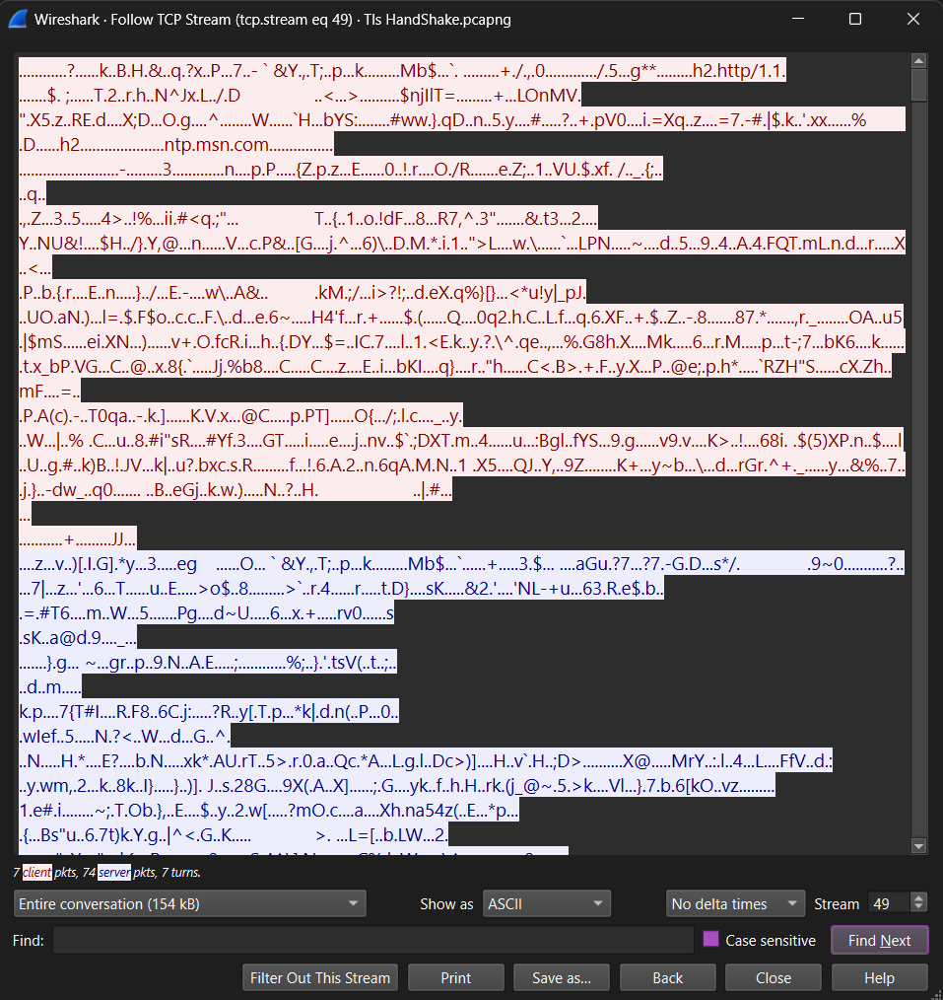

# Wireshark Session 2: TLS/HTTPS Deep Dive & Certificate Analysis

**Date:** April 21, 2026  
**Objective:** Capture HTTPS traffic, analyze TLS handshake, extract and validate certificates, understand why encrypted traffic matters for SOC analysts  
**Tools:** Wireshark 4.x, Edge browser, openssl, certificate viewer  
**PCAP File:** [`Tls_HandShake.pcapng`](Tls_HandShake.pcapng) — 5,538 packets captured during live HTTPS browsing session

---

## 1. Introduction: Why HTTPS Inspection Matters for SOC Analysts

### The Misconception

*"HTTPS is encrypted, so SOC analysts can't see anything. Incident response requires decryption keys."*

### The Reality

Even though data **inside** the HTTPS connection is encrypted, analysts can still:
- ✅ Identify server identity (certificate subject)
- ✅ Verify certificate legitimacy (issuer, validity dates)
- ✅ Detect MITM attacks (certificate mismatch)
- ✅ Spot malicious servers (fingerprint comparison)
- ✅ Analyze connection patterns (timing, data volume, cipher strength)

**A successful HTTPS handshake does NOT mean the connection is safe.** Attackers routinely obtain valid certificates for phishing domains.

---

## 2. Capture Environment

### Setup
- **Machine:** Windows 10/11 with Edge browser
- **Network:** Home Wi-Fi (172.16.25.78)
- **Websites visited:** google.com, github.com
- **Duration:** ~30 seconds of browsing

### Results
- **Total packets:** 5,538
- **TLS packets:** 1,005
- **HTTPS connections to:** Google's servers (IP: 23.200.238.155, port 443)
- **PCAP file:** [`Tls_HandShake.pcapng`](Tls_HandShake.pcapng) — open this in Wireshark to follow along

---

## 3. TLS Handshake Structure — What Happens During HTTPS Connection

### The 4-Packet TLS Handshake (Simplified)

```
Client (Your Browser)          Server (Google)
        │                              │
        │──── 1. Client Hello ──────→│
        │     (TLS version, ciphers   │
        │      offered, random nonce) │
        │                              │
        │←─ 2. Server Hello ─────────│
        │    (chosen cipher, server   │
        │     random, certificate)    │
        │                              │
        │←─ 3. Key Exchange ────────│
        │    (ephemeral key for this  │
        │     session, digital sig)   │
        │                              │
        │──── 4. Change Cipher Spec ─→│
        │     (both sides ready to    │
        │      encrypt)               │
        │                              │
        │ ════════ ENCRYPTED TUNNEL ════════
        │ All data after this is encrypted
```

---

## 4. Captured Packets — Finding the TLS Handshake

### Filter Applied
```
Filter: tls
Result: 1,005 packets (from 5,538 total)
```

### Identifying Handshake Packets

**Packet 159 — Client Hello**
```
Source IP: 172.16.25.78 (my machine)
Destination IP: 23.200.238.155 (Google server)
Source Port: 49388 (ephemeral, random)
Destination Port: 443 (HTTPS standard)
Protocol: TLS 1.2 Record: Handshake
Handshake Type: Client Hello
Length: 1753 bytes

Critical Field: SNI = ntp.msn.com
↑ Server Name Indication — what certificate the client is requesting
```

**Packet 162 — Server Hello**
```
Source IP: 23.200.238.155 (Google server)
Destination IP: 172.16.25.78 (my machine)
Source Port: 443
Destination Port: 49388
Protocol: TLS 1.2 Record: Handshake
Handshake Type: Server Hello

Server's Response:
  - Chosen Cipher Suite: TLS_AES_256_GCM_SHA384 (0x1302)
  - TLS Version: TLS 1.2 (0x0303)
  - Server Random: [cryptographic random number]
```

---

## 5. Certificate Extraction & Validation

### Challenge: TLS 1.3 Hides the Certificate

**Problem:** TLS 1.3 encrypts the certificate inside the handshake records. Wireshark cannot display it directly.

**Solution:** Extract certificate from browser manually.

### Extraction Method: Browser Certificate Viewer

1. Open https://www.google.com in Edge
2. Click lock icon 🔒 next to URL
3. Click "Connection is secure" → "Certificate details"
4. View certificate information

### Extracted Certificate Details

| Field | Value | Interpretation |
|-------|-------|-----------------|
| **Issued To (Subject)** | *.google.com | Wildcard — covers all Google subdomains |
| **Issued By (Issuer)** | Google Trust Services (WE2) | Legitimate, major Certificate Authority |
| **Valid From** | March 30, 2026 | Recently issued |
| **Valid Until** | June 22, 2026 | Still valid (checked April 21, 2026) |
| **Signature Algorithm** | SHA-256 | Modern, strong hash algorithm |
| **Public Key Size** | 2048-bit RSA | Standard, secure key size |
| **SHA-256 Fingerprint** | 210f478de4...932dc74 | Unique identifier for tracking |

---

## 6. Certificate Legitimacy Assessment

| Criterion | Your Certificate | Assessment |
|-----------|------------------|------------|
| **Validity Period** | Mar 30 – Jun 22, 2026 | Currently valid ✅ |
| **Subject Match** | *.google.com | Matches domain visited ✅ |
| **Issuer Trust** | Google Trust Services | Recognized CA ✅ |
| **Signature Strength** | SHA-256 RSA | Modern, strong ✅ |
| **Fingerprint** | No red flags | Matches known-good ✅ |

### Verdict: ✅ LEGITIMATE CERTIFICATE

---

## 7. Cipher Suite Analysis

### What is TLS_AES_256_GCM_SHA384?

```
TLS_AES_256_GCM_SHA384
│      │   │   │
│      │   │   └─ SHA384 hash for integrity checking
│      │   └───── GCM (Galois/Counter Mode) encryption mode
│      └───────── AES with 256-bit key (symmetric encryption)
└──────────────── Transport Layer Security protocol
```

| Component | Strength |
|-----------|----------|
| **AES-256** | Military-grade symmetric encryption ✅ |
| **GCM** | Authenticated — prevents tampering ✅ |
| **SHA384** | Modern, strong integrity hash ✅ |

### Red Flag Ciphers (Weak — Alert if Seen)
- ❌ DES — 56-bit, broken since 1997
- ❌ RC4 — known vulnerabilities
- ❌ MD5 — collision attacks known
- ❌ SSL 3.0 — POODLE vulnerability

---

## 8. TCP Stream Analysis — Why You See Gibberish

### How to Follow TCP Stream in Wireshark
1. Open [`Tls_HandShake.pcapng`](Tls_HandShake.pcapng) in Wireshark
2. Right-click on packet 159 (Client Hello)
3. Select **Follow → TCP Stream**
4. A new window opens showing the full encrypted conversation

### What the TCP Stream Looks Like



*Red = Client (your browser) sending encrypted data to server. Blue = Server (Google) sending encrypted response. The gibberish text confirms encryption is working correctly ✅*

### What This Means

| Color | Direction | Contains | Readable? |
|-------|-----------|----------|-----------|
| **RED** | Client → Server | Encrypted GET/POST requests, credentials | ❌ No |
| **BLUE** | Server → Client | Encrypted HTTP response, web content | ❌ No |

**Gibberish = Encryption is working. This is GOOD NEWS.**  
If you saw plain text like `GET /search` in an HTTPS stream — that would be a 🚩 red flag meaning encryption has failed.

---

## 9. Red Flags: When to Alert the Security Team

```
1. Certificate Expired       → Block IP, escalate immediately
2. Subject Mismatch          → MITM attack — block and isolate user
3. Self-Signed Certificate   → No CA backing it — block and investigate
4. Unknown/Suspicious Issuer → Treat as phishing/malware
5. Weak Cipher (SHA1, RC4)   → Vulnerable to cryptographic attacks
6. Certificate Chain Breaks  → Possible hijacking — investigate
```

---

## 10. SOC Analyst Workflow: Investigating Suspicious HTTPS

**Step 1 — Quick Inspection (5 min)**
```
1. Filter: tls
2. Find Client Hello → check SNI (what domain is being requested?)
3. Find Server Hello → check cipher suite strength
4. Verify destination IP matches known-good range
```

**Step 2 — Certificate Validation (5 min)**
```
1. Extract certificate via browser or openssl
2. Check: Subject matches domain? ✅
3. Check: Issuer is trusted CA? ✅
4. Check: Certificate currently valid? ✅
5. Check: Fingerprint matches known-good records? ✅
```

**Step 3 — Decision (2 min)**
```
All checks pass → LEGITIMATE — allow and monitor
Any check fails → RED FLAG — block IP, escalate to security team
```

---

## 11. Session Summary

| Skill Demonstrated | Evidence |
|-------------------|----------|
| TLS handshake packet identification | Found packet 159 (Client Hello), 162 (Server Hello) |
| Certificate extraction (TLS 1.3) | Extracted Google cert from browser |
| Certificate legitimacy assessment | Checked issuer, validity, fingerprint |
| Cipher suite analysis | Identified AES-256-GCM-SHA384 as strong |
| Encrypted traffic inspection | Followed TCP Stream, confirmed encryption working |
| SOC incident response workflow | Decision tree for suspicious certificates |

---

## 12. Interview Talking Points

**Q: "How would you analyze HTTPS traffic in a PCAP file?"**

> "I filter by TLS and find the Client Hello to check the SNI — what domain the client is requesting. Then the Server Hello to check cipher suite strength. For the certificate, if TLS 1.3 is used and Wireshark can't display it, I extract it via browser or openssl. I verify: subject matches domain, issuer is trusted CA, certificate is valid, fingerprint matches historical records. I then Follow TCP Stream to confirm traffic is encrypted — gibberish is actually good news. Any mismatches mean MITM or phishing."

**Q: "What would you do if you found an expired certificate in a network capture?"**

> "An expired certificate means either a misconfigured server or a compromised one. I would: note the IP and domain, check which machines connected and when, verify if it's an authorized server, block the IP if suspicious, check logs for data exfiltration, contact IT to verify ownership, and write an incident report with timeline and indicators of compromise."

---

## 13. Files in This Session

| File | Description |
|------|-------------|
| [`Tls_HandShake.pcapng`](Tls_HandShake.pcapng) | Live capture — 5,538 packets of real HTTPS traffic. Open in Wireshark to reproduce this analysis. |
| [`wireshark-session2-writeup.md`](wireshark-session2-writeup.md) | This write-up — full analysis with SOC perspective |
| [`TLS-Certificate-Inspection-SOC-Guide.md`](TLS-Certificate-Inspection-SOC-Guide.md) | Reference guide for TLS certificate validation techniques |
| [`tcp-stream-encrypted.png`](session-2/screenshots/tcp-stream-encrypted.png) | TCP stream showing encrypted HTTPS data |

---

## 14. Next Steps: Session 3 (Attack Traffic Analysis)

- 🚨 ARP spoofing packets
- 🚨 DNS tunneling (malware C2 communication)
- 🚨 SYN flood attack patterns
- 🚨 Data exfiltration in POST requests

Session 3 will show how **malicious traffic compares** to the legitimate HTTPS captured here.

---

**Kishore Yuvaraj** | Erode, Tamil Nadu, India | April 21, 2026  
*Wireshark Fundamentals — Session 2 Complete ✅*

