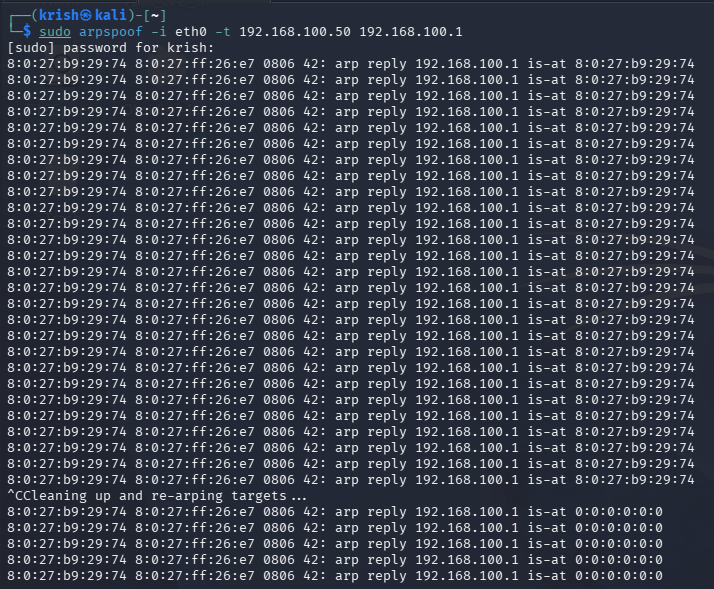
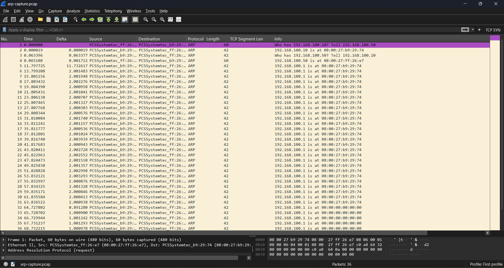
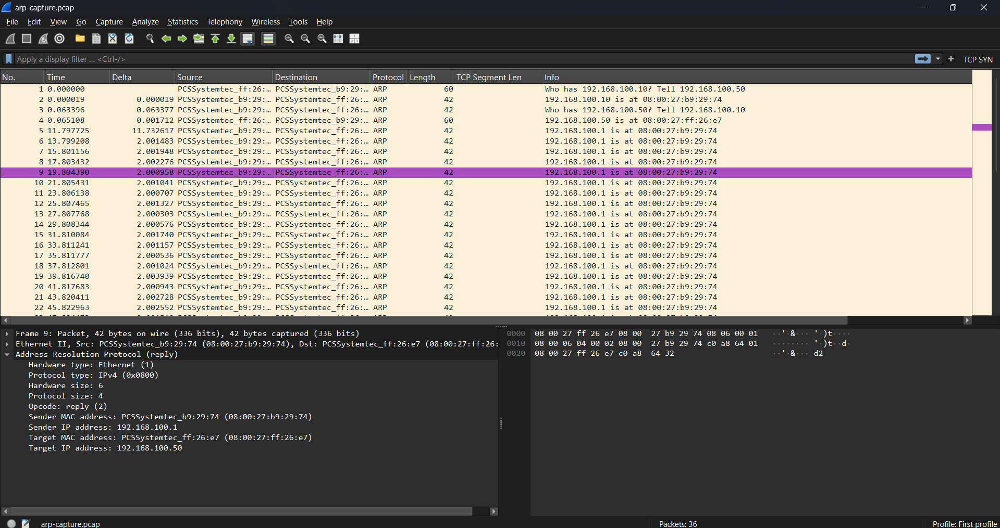

# Session 3A: ARP Spoofing Attack — Live Lab Simulation & Packet Analysis

**Date:** May 2, 2026
**Difficulty:** Intermediate
**Tools:** Kali Linux, Ubuntu Desktop(version 24.04), VirtualBox, arpspoof, tcpdump, Wireshark
**Lab Type:** Isolated internal network (no internet — safe simulation)

---

## 🎯 Objective

Simulate a real ARP spoofing (MITM) attack in a controlled lab environment, capture the attack packets using tcpdump, and analyze the forensic evidence in Wireshark — exactly as a SOC analyst would during incident response.

---

## 🏗️ Lab Architecture

```
VirtualBox Isolated Internal Network ("labnet")
NO internet connection — completely safe

┌─────────────────────────────────────────┐
│         labnet (192.168.100.0/24)       │
│                                         │
│  ┌──────────────┐    ┌───────────────┐  │
│  │ Kali Linux   │    │ Ubuntu Desktop│  │
│  │ (ATTACKER)   │◄──►│ (VICTIM)      │  │
│  │192.168.100.10│    │192.168.100.50 │  │
│  │MAC:b9:29:74  │    │MAC:ff:26:e7   │  │
│  └──────────────┘    └───────────────┘  │
└─────────────────────────────────────────┘
```

### Network Configuration

| Machine | Role | IP Address | MAC Address |
|---------|------|-----------|-------------|
| Kali Linux | Attacker | 192.168.100.10 | 08:00:27:b9:29:74 |
| Ubuntu Desktop | Victim | 192.168.100.50 | 08:00:27:ff:26:e7 |
| Gateway (simulated) | Target IP | 192.168.100.1 | (spoofed) |

---

## 📖 Theory: What is ARP Spoofing?

### How ARP Works Normally

ARP (Address Resolution Protocol) translates IP addresses to MAC addresses so packets know which physical cable to travel through.

```
Normal ARP Flow:
Ubuntu asks:  "Who has 192.168.100.1? Tell 192.168.100.50"
Router says:  "192.168.100.1 is at AA:BB:CC:DD:EE:FF"
Ubuntu saves: 192.168.100.1 → AA:BB:CC:DD:EE:FF (in ARP table)
Ubuntu sends: All gateway traffic to AA:BB:CC:DD:EE:FF ✅
```

### How ARP Spoofing Works

**Critical weakness: ARP has NO authentication.** Any device can claim any IP.

```
ARP Spoofing Flow:
Kali lies:    "192.168.100.1 is at 08:00:27:b9:29:74" (repeatedly)
Ubuntu saves: 192.168.100.1 → 08:00:27:b9:29:74 (WRONG — Kali's MAC)
Ubuntu sends: All gateway traffic to KALI instead of router ❌
Result:       Kali intercepts ALL of Ubuntu's traffic (MITM)
```

### Why This Is Dangerous

Once Kali is in the middle, it can:
- 🔍 **Read** all unencrypted traffic (credentials, HTTP data)
- 🔄 **Modify** packets in transit (inject malware)
- 🚫 **Drop** packets (denial of service)
- 📡 **Redirect** traffic to malicious servers

---

## 🔧 Lab Setup

### Step 1: VirtualBox Network Configuration

Both VMs configured with:
- **Adapter 1:** Internal Network
- **Network Name:** `labnet`
- **Promiscuous Mode:** Allow VMs

This creates an isolated network invisible to the real network.

### Step 2: Static IP Assignment

**Kali Linux** (`/etc/network/interfaces`):
```
auto eth0
iface eth0 inet static
    address 192.168.100.10
    netmask 255.255.255.0
    gateway 192.168.100.1
```

**Ubuntu Desktop** (via netplan `/etc/netplan/01-network-manager-all.yaml`):
```yaml
network:
  version: 2
  ethernets:
    enp0s3:
      dhcp4: no
      addresses:
        - 192.168.100.50/24
      routes:
        - to: default
          via: 192.168.100.1
```

### Step 3: Verify Connectivity

```bash
# From Ubuntu — ping Kali
ping 192.168.100.10 -c 4

# Expected output:
64 bytes from 192.168.100.10: icmp_seq=1 ttl=64 time=5.01 ms
64 bytes from 192.168.100.10: icmp_seq=2 ttl=64 time=1.33 ms
4 packets transmitted, 4 received, 0% packet loss ✅
```

### Step 4: Install Attack Tool

```bash
# Kali — arpspoof is part of dsniff package
sudo apt-get install dsniff -y
which arpspoof
# Output: /usr/bin/arpspoof ✅
```

---

## ⚔️ Attack Execution

### Step 1: Start Packet Capture (Kali Terminal 1)

```bash
sudo tcpdump -i eth0 arp -w /tmp/arp-capture.pcap
```

Output:
```
tcpdump: listening on eth0, link-type EN10MB (Ethernet), snapshot length 262144 bytes
```

### Step 2: Generate Victim Traffic (Ubuntu)

```bash
# Continuous ping to keep traffic flowing
ping 192.168.100.10 -t
```

### Step 3: Launch ARP Spoofing Attack (Kali Terminal 2)

```bash
sudo arpspoof -i eth0 -t 192.168.100.50 192.168.100.1
```

**Command breakdown:**
- `-i eth0` — Use Kali's network interface
- `-t 192.168.100.50` — Target: Ubuntu (victim)
- `192.168.100.1` — Claim to be this IP (the gateway)

### Attack Output



```
8:0:27:b9:29:74 8:0:27:ff:26:e7 0806 42: arp reply 192.168.100.1 is-at 8:0:27:b9:29:74
8:0:27:b9:29:74 8:0:27:ff:26:e7 0806 42: arp reply 192.168.100.1 is-at 8:0:27:b9:29:74
8:0:27:b9:29:74 8:0:27:ff:26:e7 0806 42: arp reply 192.168.100.1 is-at 8:0:27:b9:29:74
[repeated every 2 seconds...]
^CCleaning up and re-arping targets...
```

**Reading the output:**
- `8:0:27:b9:29:74` = Kali's MAC (attacker)
- `8:0:27:ff:26:e7` = Ubuntu's MAC (victim receiving the lie)
- `arp reply 192.168.100.1 is-at 8:0:27:b9:29:74` = **THE LIE**

---

## 🔬 Wireshark Analysis

### Capture File Details
- **File:** `arp-capture.pcap`
- **Total packets:** 36
- **Duration:** ~65 seconds
- **Protocol:** 100% ARP

### Packet Overview



**Filter used:** `arp.opcode == 2` (shows only ARP replies)
**Result:** 34 packets — ALL unsolicited replies from Kali

### Individual Packet Dissection



**Expanding `Address Resolution Protocol (reply)` in Wireshark:**

```
Hardware type:    Ethernet (1)
Protocol type:    IPv4 (0x0800)
Hardware size:    6
Protocol size:    4
Opcode:           reply (2)          ← Unsolicited = SUSPICIOUS
Sender MAC:       08:00:27:b9:29:74  ← Kali (the attacker)
Sender IP:        192.168.100.1      ← THE LIE (claiming to be gateway)
Target MAC:       08:00:27:ff:26:e7  ← Ubuntu (the victim)
Target IP:        192.168.100.50     ← Ubuntu's real IP
```

---

## 🔍 Forensic Evidence — 3 Layers of Proof

### Evidence 1: Regular 2-Second Intervals (Delta Column)

| Packet | Delta Time | Significance |
|--------|-----------|--------------|
| 6 | 2.001483s | Automated tool |
| 7 | 2.001948s | Automated tool |
| 8 | 2.002276s | Automated tool |
| 9 | 2.000958s | Automated tool |
| 10 | 2.001041s | Automated tool |

**Normal ARP:** Random timing, only triggered when a device needs to resolve an IP.
**Attack pattern:** Perfectly regular ~2-second intervals = automated arpspoof tool running.

> 🚨 **Detection Rule:** Alert when same source sends ARP replies at perfectly regular intervals (variance < 10ms)

---

### Evidence 2: Unsolicited ARP Replies (Gratuitous ARP)

```
Filter: arp.opcode == 2
Result: 34 reply packets
Matching requests: 0
```

**Normal ARP:** Every reply has a matching request (request → reply pair).
**Attack pattern:** 34 replies with ZERO matching requests = nobody asked, Kali is lying.

> 🚨 **Detection Rule:** Alert on ARP replies with no corresponding ARP request in last 5 seconds

---

### Evidence 3: ARP Flood (65.1% of Traffic)

```
Statistics → Protocol Hierarchy:
ARP: 65.1% of total captured traffic
```

**Normal network:** ARP is typically less than 1% of traffic.
**Attack pattern:** 65.1% ARP = machine is constantly flooding the network with fake replies.

> 🚨 **Detection Rule:** Alert when ARP exceeds 5% of total traffic from single source

---

### Evidence 4: ARP Table Poisoning Confirmed


**On Ubuntu after attack:**
```bash
ip neigh show
# Output:
192.168.100.10 dev enp0s3 lladdr 08:00:27:b9:29:74 STALE
```

Ubuntu's ARP table shows Kali's MAC (`b9:29:74`) for the gateway IP — **confirmed poisoning**.

---

## 🧠 SOC Analyst Detection Framework

### Real-Time Detection Rules

```
RULE 1: Gratuitous ARP Detection
  IF arp.opcode == 2
  AND no matching arp.opcode == 1 within 5 seconds
  THEN alert "Possible ARP Spoofing — Gratuitous ARP detected"
  SEVERITY: High

RULE 2: ARP Flood Detection  
  IF ARP packets from single source > 10/minute
  THEN alert "Possible ARP Spoofing — ARP Flood detected"
  SEVERITY: High

RULE 3: IP-MAC Mismatch Detection
  IF known IP resolves to unexpected MAC
  AND MAC changed from previous known value
  THEN alert "Possible ARP Spoofing — ARP Table Poison detected"
  SEVERITY: Critical

RULE 4: Gateway MAC Change
  IF gateway IP (x.x.x.1) ARP reply comes from non-gateway MAC
  THEN alert "Critical — Gateway ARP Spoofing detected"
  SEVERITY: Critical
```

---

## 🚨 Incident Response Procedure

### If ARP Spoofing Is Detected in Production:

**Step 1: Immediate Containment (0–5 minutes)**
```
1. Identify attacker's MAC address from ARP packets
2. Block MAC at switch level immediately:
   switchport port-security mac-address sticky
3. Isolate affected network segment
4. Alert security team
```

**Step 2: Identify Scope (5–30 minutes)**
```
1. Check all machines' ARP tables:
   ip neigh show (Linux)
   arp -a (Windows)
2. Find all machines with poisoned ARP entries
3. Determine how long attack was running (check logs)
4. Check if any sensitive data was in transit
```

**Step 3: Evidence Collection (30–60 minutes)**
```
1. Export PCAP file from IDS/firewall
2. Screenshot ARP tables from all affected machines
3. Collect switch logs (MAC address table changes)
4. Document attacker MAC → trace to physical port
5. Preserve all evidence for forensics
```

**Step 4: Remediation**
```
1. Restore correct ARP entries:
   arp -s 192.168.100.1 AA:BB:CC:DD:EE:FF (static entry)
2. Enable Dynamic ARP Inspection (DAI) on managed switches
3. Implement 802.1X port authentication
4. Add static ARP entries for critical devices (gateway, DNS)
5. Deploy ARP monitoring tool (arpwatch)
```

**Step 5: Incident Report**
```
Title: ARP Spoofing MITM Attack Detected
Time: [timestamp]
Attacker MAC: 08:00:27:b9:29:74
Victim IP: 192.168.100.50
Spoofed IP: 192.168.100.1 (gateway)
Duration: ~65 seconds
Data at risk: All unencrypted traffic from victim
Action taken: MAC blocked, ARP tables restored
Prevention: DAI enabled on switch
```

---

## 🛡️ Defenses Against ARP Spoofing

| Defense | How It Works | Where to Implement |
|---------|-------------|-------------------|
| **Dynamic ARP Inspection (DAI)** | Switch validates ARP packets against DHCP snooping table | Managed switches |
| **Static ARP entries** | Manually map critical IP→MAC (can't be overwritten) | Critical servers, gateways |
| **arpwatch** | Monitors ARP table changes, alerts on changes | Linux servers |
| **802.1X port authentication** | Devices must authenticate before network access | Enterprise networks |
| **Network segmentation** | VLANs limit ARP broadcast domain | All networks |
| **Encrypted protocols** | HTTPS, SSH, TLS — even if intercepted, data is unreadable | All applications |

---

## 📊 Attack Summary

| Metric | Value |
|--------|-------|
| **Attack tool** | arpspoof (dsniff package) |
| **Packets sent** | 36 ARP packets |
| **Attack duration** | ~65 seconds |
| **Interval** | ~2 seconds between packets |
| **Target** | Ubuntu 192.168.100.50 |
| **Spoofed IP** | 192.168.100.1 (gateway) |
| **Result** | Ubuntu ARP table poisoned ✅ |
| **Detection** | 3 forensic indicators identified ✅ |

---

## 📁 Artifacts

| File | Description |
|------|-------------|
| `arp-capture.pcap` | Raw packet capture (36 ARP packets) |
| `screenshots/01-kali-arpspoof-running.png` | Kali terminal showing attack output |
| `screenshots/02-wireshark-arp-packets.png` | Wireshark with delta column showing 2s intervals |
| `screenshots/03-packet-dissection-fields.png` | ARP packet fields expanded (Sender MAC/IP = the lie) |
| `screenshots/04-ubuntu-arp-table-poisoned.png` | Ubuntu ip neigh show showing poisoned entry |

---

## 🔄 Next Sessions

| Session | Topic |
|---------|-------|
| **Session 3B** | DNS Tunneling — how malware hides C2 traffic in DNS queries |
| **Session 3C** | SYN Flood + Data Exfiltration — DoS attacks and detecting data theft |
| **Session 4** | CTF-style challenge — analyze mystery PCAP, extract IoCs |

---

*Kishore Yuvaraj | Tamil Nadu, India | May 2, 2026*
